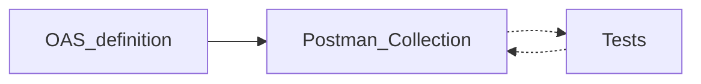
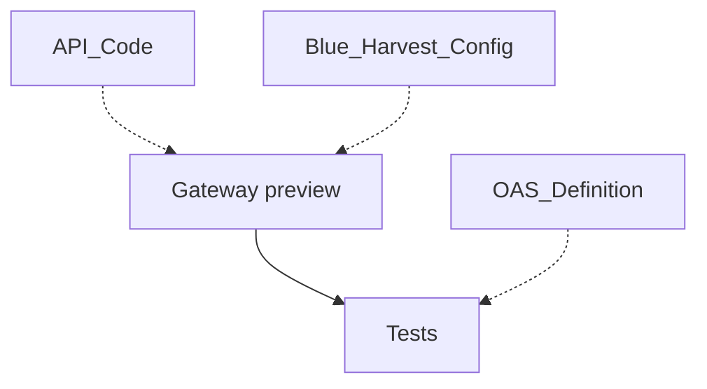

# Postman

- Postman approach is based on extensive usage of Postman Collections. 
Whenever we want to use Postman-like tests we have to maintain also a Postman Collection.
We can transfer a Collection to an OAS definition but we'll lose connection to tests.

- We can use PM syntax but it's quite inconvenient when referred to OAS. 
Basically you have to redeclare most of the OAS concepts but with a bit different syntax.

# Integration 

- The test runner could be implemented as a separate tool and could be integrated into Blue Harvest wherever we want since we're going to use isolated instances.
- Basic flow could be:

# Declarative Test Runner

Declarative testing has the following benefits:
- They aren't programming language-specific, so tests could be written by anyone.
- The proposed syntax resembles OAS spec and could be reused.
- It could automatically inherit OAS definition's data.

# Plans

- Make the declarative test runner fully functional (secrets, links to definition, assertions, coverage, snapshot testing, etc.)
<!-- - Auto generate OAS definition from tests? -->

# Questions

- How do our users want to write tests?
- What is the supposed structure of our customers' repositories? 

Step-by-step guides ?